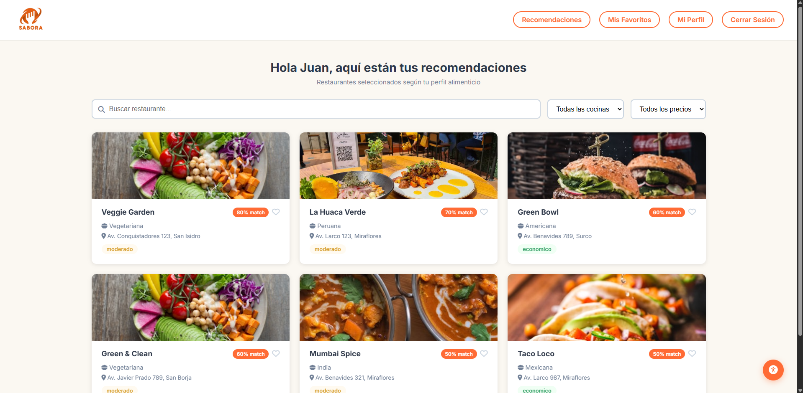
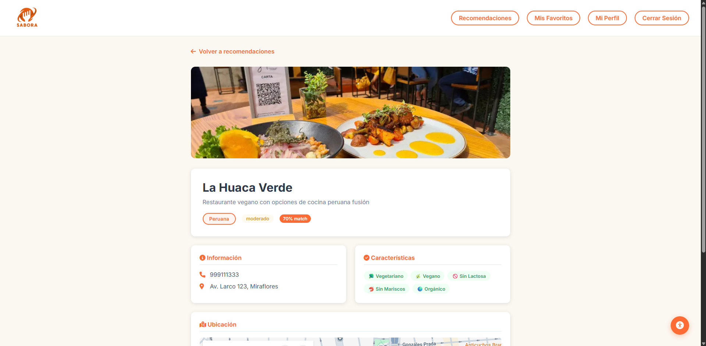
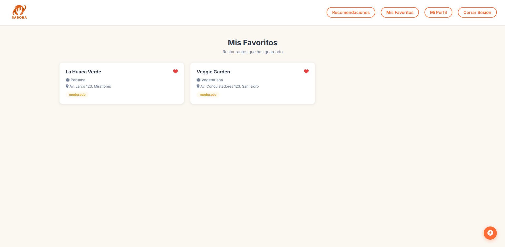
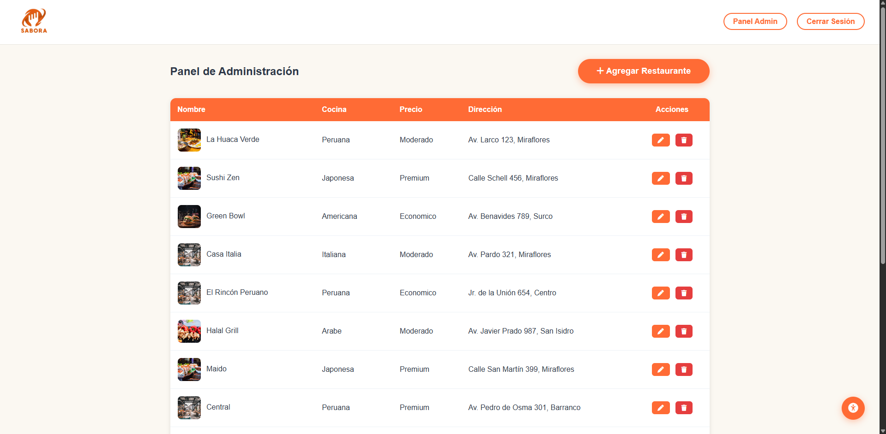
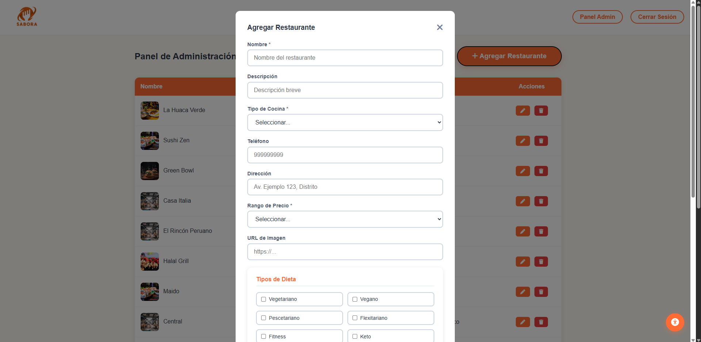

# SABORA 🍽️

Sistema web de recomendación de restaurantes personalizado según el perfil alimenticio del usuario (vegetariano, vegano, sin lactosa, fitness, etc.). Calcula un **porcentaje de match** entre cada restaurante y las preferencias del usuario mediante una vista SQL.

## 🎯 Funcionalidades

- **Recomendaciones personalizadas**: cada restaurante muestra un % de match calculado según el perfil alimenticio del usuario
- **Autenticación**: registro e inicio de sesión con roles (usuario / admin)
- **Búsqueda y filtros**: por nombre, tipo de cocina y rango de precio
- **Favoritos**: guarda restaurantes para acceder rápido después
- **Detalle de restaurante**: información completa, características dietéticas y ubicación con Google Maps
- **Panel de administración**: CRUD completo de restaurantes (nombre, tipo de cocina, precio, dirección, imagen, tipos de dieta compatibles)
- **Widget de accesibilidad**: ajustes de contraste y tamaño de texto

## 🛠️ Stack técnico

- **Backend**: Node.js, Express
- **Base de datos**: MySQL — con vista SQL personalizada para el cálculo de match-score
- **Frontend**: JavaScript vanilla, HTML, CSS
- **Integraciones**: Google Maps (ubicación), Unsplash API (imágenes de restaurantes)

## 📂 Estructura del proyecto

```
backend/
├── controllers/    # auth, favoritos, perfil, recomendaciones, restaurantes
├── routes/         # rutas por módulo
├── database.js     # conexión MySQL
└── server.js

database/
└── sabora.sql      # schema + vista de match-score

frontend/
├── css/
├── js/             # lógica por página (login, registro, recomendaciones, admin, etc.)
└── pages/          # login, registro, recomendaciones, detalle, favoritos, perfil, admin
```

## 📸 Capturas de pantalla

### Landing y autenticación
| Landing | Login | Registro |
|---|---|---|
|  |  |  |

### Recomendaciones y detalle
| Recomendaciones (match-score) | Detalle de restaurante | Favoritos |
|---|---|---|
|  |  |  |

### Panel de administración
| Listado (CRUD) | Agregar restaurante |
|---|---|
|  |  |

## 🚀 Cómo ejecutar el proyecto

1. Clona este repositorio
2. Instala dependencias:
```bash
npm install
```
3. Crea la base de datos con el script `database/sabora.sql`
4. Configura las variables de entorno (conexión MySQL, API keys de Google Maps y Unsplash)
5. Inicia el servidor:
```bash
node backend/server.js
```
6. Abre `frontend/index.html` en tu navegador (o sírvelo con Live Server)

## 💡 Contexto del proyecto

SABORA resuelve un problema común: elegir un restaurante que realmente se ajuste a restricciones alimenticias específicas (vegano, sin lactosa, fitness, etc.) sin tener que revisar manualmente cada opción. El sistema calcula automáticamente qué tan compatible es cada restaurante con el perfil del usuario.

## 👤 Autor

**Juan Diego Constantino** — Estudiante de Ingeniería de Sistemas, UPN
[GitHub](https://github.com/Juandi1602) | [LinkedIn](https://www.linkedin.com/in/juan-diego-constantino-8571b5344/)
